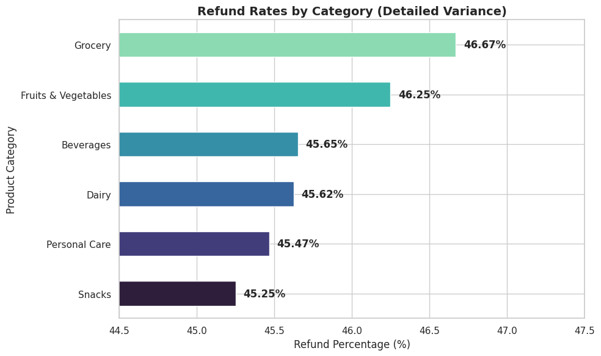
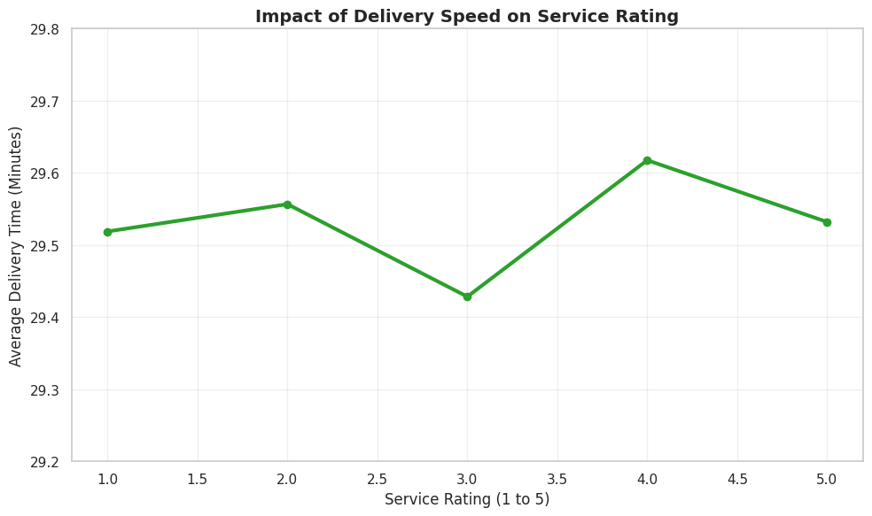

# E-commerce Delivery & Refund Analytics
*Analyzing 100,000+ rows of Quick-Commerce data to improve service quality.*

---

## Project Objective
The goal of this project is to evaluate the performance of major Indian delivery platforms (**Blinkit, Swiggy Instamart, JioMart**). By analyzing delivery delays and refund requests, I identified specific categories that require operational improvements.

## Key Insights
### **1. High-Risk Category Analysis**
While refund rates are high across the board, **Grocery** and **Fruits & Vegetables** lead with a **~46.7% refund rate**. 
* **Action:** This indicates a need for category-specific quality-assurance protocols for perishable items.

### **2. The Delivery-Rating Correlation**
My analysis revealed that service ratings remain stable around **3.2** regardless of minor fluctuations in delivery time (29.2 to 29.8 minutes).
* **Observation:** Customers appear to have a 30-minute psychological threshold; speed improvements below this mark do not significantly boost ratings.

---

## Recommendations
Based on the data, I propose the following solutions for an Analyst Trainee to implement:
1. **Systemic QC Improvement:** Focus on reducing the 46% baseline refund rate, which suggests a platform-wide technical or logistics error rather than a category-specific one.
2. **Logistics Optimization:** Since small delays don't hurt ratings, implementing **batch-delivery** could reduce operational costs while maintaining current satisfaction levels.
3. **Sentiment Deep-Dive:** The next phase should involve **Sentiment Analysis** of the "Customer Feedback" text to find the "Why" behind the 1 and 2-star ratings.

---

## Tech Stack & Skills
* **Tool:** Google Colab / VS Code
* **Language:** Python (Pandas, Matplotlib, Seaborn)
* **Analytical Skills:** Data Cleaning, Exploratory Data Analysis (EDA), and Data Visualization

---

